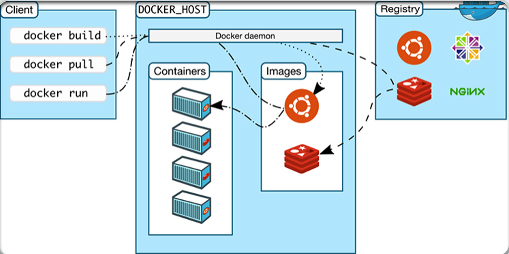

# Docker Principles
- **Build**
  - Docker images are efficiently developed for your own unique applications on Windows and Mac. Create your multi container application using the Docker Compose CLI.
  - Integrate with your favorite tools throughout your development pipeline - Docker works with all development tools you use including VS Code, CircleCI and GitHub.
  - Package applications as portable container images to run in any environment consistently from on-premises Kubernetes to AWS ECS, Azure ACI, Google GKS and more.
- **Share**
  - Leverage with confidence Docker certified and official images from the Docker Hub image repository.  Use these trusted and secure images as the foundation for your application development.
  - Innovate by collaborating with team members and other developers and by easily publishing images to Docker Hub.
  - Personalize developer access to images with roles based access control and get insights into activity history with Docker Hub Audit Logs.
- **Run**
  - Deliver multiple applications hassle free and have them run the same way on all your environments including design, testing, staging and production - desktop or cloud-native.
  - Deploy your applications in separate containers independently and in different languages. Reduce the risk of conflict between languages, libraries or frameworks.
  - Speed development with the simplicity of Docker Compose CLI and with one command, launch your applications locally and on the cloud with AWS ECS, Azure ACI and Google GKS.
## Docker Components
- Docker Server
- Docker CLI
- Docker Regitry
- containerd (runc)
- Docker Objects
  - Images
  - Containers
  - Volumes
    - volume mount
    - bind mount
    - tmpfs mount
  - Network
    - bridge
    - host
    - none
    - overlay
    - macvlan



## Docker Server
**Docker server/daemon** is a service that runs in the background to handle the request from CLI/API to create a object for application deployment.
```
Login to Docker host machines (Docker host/machine is nothing but server(Virtual Machine or Baremetal) where docker was installed)
#systemctl status docker
root@ubuntuserverdocker:~# systemctl status docker
● docker.service - Docker Application Container Engine
     Loaded: loaded (/lib/systemd/system/docker.service; enabled; vendor preset: enabled)
     Active: active (running) since Fri 2021-08-06 12:03:42 UTC; 2min 31s ago
TriggeredBy: ● docker.socket
       Docs: https://docs.docker.com
   Main PID: 734 (dockerd)
      Tasks: 8
     Memory: 132.3M
     CGroup: /system.slice/docker.service
             └─734 /usr/bin/dockerd -H fd:// --containerd=/run/containerd/containerd.sock

Aug 06 12:03:41 ubuntuserverdocker dockerd[734]: time="2021-08-06T12:03:41.117693331Z" level=warning msg="Your kern>
Aug 06 12:03:41 ubuntuserverdocker dockerd[734]: time="2021-08-06T12:03:41.117898290Z" level=warning msg="Your kern>
Aug 06 12:03:41 ubuntuserverdocker dockerd[734]: time="2021-08-06T12:03:41.118017433Z" level=warning msg="Your kern>
Aug 06 12:03:41 ubuntuserverdocker dockerd[734]: time="2021-08-06T12:03:41.141615974Z" level=info msg="Loading cont>
Aug 06 12:03:41 ubuntuserverdocker dockerd[734]: time="2021-08-06T12:03:41.825026931Z" level=info msg="Default brid>
Aug 06 12:03:41 ubuntuserverdocker dockerd[734]: time="2021-08-06T12:03:41.906369401Z" level=info msg="Loading cont>
Aug 06 12:03:42 ubuntuserverdocker dockerd[734]: time="2021-08-06T12:03:42.126140136Z" level=info msg="Docker daemo>
Aug 06 12:03:42 ubuntuserverdocker dockerd[734]: time="2021-08-06T12:03:42.128740739Z" level=info msg="Daemon has c>
Aug 06 12:03:42 ubuntuserverdocker systemd[1]: Started Docker Application Container Engine.
Aug 06 12:03:42 ubuntuserverdocker dockerd[734]: time="2021-08-06T12:03:42.174697365Z" level=info msg="API listen o>
root@ubuntuserverdocker:~#

Inorder to check the process of docker daemon service, execute below command
#ps aux | grep dockerd
root@ubuntuserverdocker:~# ps aux | grep dockerd
root         734  0.7  1.4 725320 87812 ?        Ssl  12:03   0:01 /usr/bin/dockerd -H fd:// --containerd=/run/containerd/containerd.sock
root@ubuntuserverdocker:~#
```

## Docker CLI
**Docker CLI** utility is used to create objects and to intract with docker daemon.
we can also run API calls to create objects as well.
```
Few CLI commands example:
#docker image ls
#docker info
#docker ps
```

## Docker Registry
**Docker Registry** is used to pull public/private images to local docker host machine for running specific applications.
```
Examples:
1) Docker Hub
2) Gilab Registry
3) Local registry to store images in container level on Docker host (Image: registry:2)
4) AWS ECR(Elastic Container Registry) and few more etc.,
References: https://docs.docker.com/registry/
```

## Containerd runtime
**containerd** was used for Docker as a backend component to create/run applications.
containerd is available as a daemon for Linux and Windows. It manages the complete container lifecycle of its host system, from image transfer and storage to container execution and supervision to low-level storage to network attachments

## Images
- Images are used to create containers, which is bundled as layers with OS/Application specific libraries and binaries.
- Images Doesn't has kernel for which size of image will be too small, which helps to expose less vulnerabilities.
- Images can be downloaded from official public **Docker Hub repository** or private repository by authentication.
- we can build custom images with the help of **Dockerfile**.
- Image layers are read-only which helps to share images with multiple containers.
- containers uses COW(Copy-On-Write) strategy to modify the filesystem data on container layer.

## Containers
- Containers are the actual layer where your applications will be running.
- Containers running on the Docker Host are isolated with each otrher using Linux kernel features like namespaces and cgroups.
- Containers created with help of images which do not have any kernel.
- Creation/destroy of containers happens in fraction of seconds, since its doesn't kernel and other unnecessary service running.