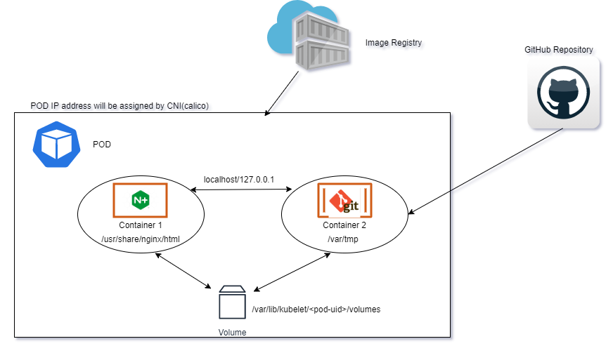

# POD

**POD will ensure that container with one or more are logically grouped to gather to have common network and shared storage. POD will assigned with an IP address with the help of CNI (container network interface add-on) like calico,  wavenet, flannel (deprecated) etc.,**

- The pods use NAT to communicate with other resources outside the Kubernetes cluster. This approach reduces the number of IP addresses you need to reserve in your network space for pods to use.

## Networking
Each Pod is assigned a unique IP address. Every container in a Pod shares the network namespace of a POD namespace,including the IP address and network ports. Containers inside a Pod can communicate with one another using localhost. When containers in a Pod communicate with entities outside the Pod, they must coordinate how they use the shared network resources (such as ports).

## Storage
A Pod can specify a set of shared storage Volumes. All containers in the Pod can access the shared volumes, allowing those containers to share data. Volumes also allow persistent data in a Pod to survive in case one of the containers within needs to be restarted. See Volumes for more information on how Kubernetes implements shared storage in a Pod.

Note:
The Pod remains on that Node until the process is terminated, the pod object is deleted, the Pod is evicted for lack of resources, or the Node fails.

## resources:
CPU resources are measured in millicore. If a node has 2 cores, the node’s CPU capacity would be represented as 2000m. The unit suffix m stands for “thousandth of a core.” 1000m or 1000 millicore is equal to 1 core. 4000m would represent 4 cores. 250 millicore per pod means 4 pods with a similar value of 250m can run on a single core. On a 4 core node, 16 pods each having 250m can run on that node.

Memory is measured in bytes. However, you can express memory with various suffixes (E,P,T,G,M,K and Ei, Pi, Ti, Gi, Mi, Ki) to express mebibytes (Mi) to petabytes (Pi). Most simply use Mi.

## Different ways to create a POD:

- POD with single container
- POD with multi-container (means more than one container)
- Static POD (controlled by kubelet component directly running as daemon on each node in the cluster, not through API server)

## Container types in POD
**POD are created with application containers, initContainers and ephemeral containers to debug**

- **containers:** these will be running all the time to access/service application.
- **initContainers:** these will not be running all the time, once task/job was done. Containers under init will be terminated if exit status was 0.
- **ephemeral containers:**
  - Special type of container that runs temporarily in an existing Pod to accomplish user-initiated actions such as troubleshooting.
  - These containers differ from other containers which do not have ports, livenessProbe, readinessProbe section.
  - resources are immutable, so these are not allowed [Reference](https://kubernetes.io/docs/reference/generated/kubernetes-api/v1.22/#ephemeralcontainer-v1-core).
  - we can't add emphemeral containers using #kubectl edit command, they are added using "ephemeralcontainers" handler in the API.
  - you can't change or remove an ephemeral container after they have added it to a Pod.

## Containers Patterns in POD

- **Sidecar containers:**
- 
- **Ambassador containers:**
- 
- **Adapter containers:**
- 
- [Reference](https://kubernetes.io/blog/2015/06/the-distributed-system-toolkit-patterns/)