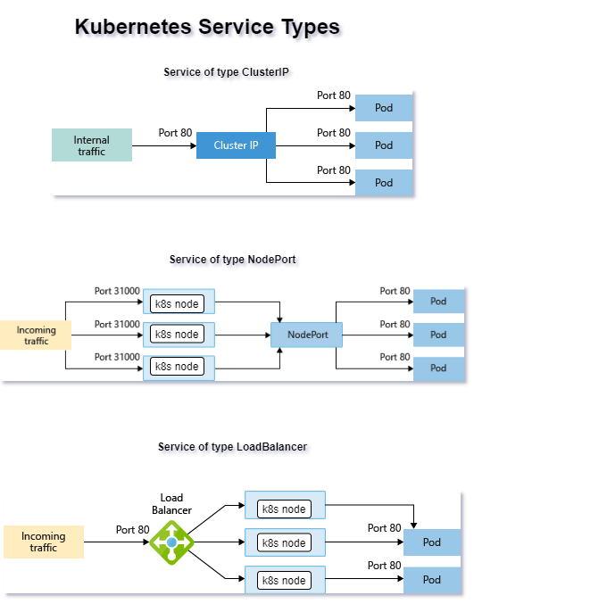

# Services
- Service is way to communicate the backend PODs using Loadbalancer which is inbuild functionality of kubernetes, insteed of using external loadbalancer
- Service can also be created in two ways: Headless and Normal(clusterIP)
- Services identify backend PODs based on **Endpoints object** created while using **Selector**
- Services can handle PODs with Selector(automatically --> default) and without selector(Manual creation of Endpoint with help of ExternalName etc.,)

## Different values supported for type in service spec:
- ClusterIP(default), NodePort, LoadBalancer, EnternalName, ExternalIP, Healess (ClusterIP: None)



- Supported Protocols:
```
TCP, UCP, HTTP, SCTP
```
- Default Kubernetes service type is clusterIP, When you create a headless service by setting clusterIP None, no load-balancing is done and no cluster IP is allocated for this service. Only DNS is automatically configured. When you run a DNS query for headless service, you will get the list of the Pods IPs and usually client dns chooses the first DNS record.
```
Example:
1)kubectl create deployment nginx --image=nginx
2)kubectl scale --replicas=3 deployment nginx
3)kubectl expose deployment nginx --name nginxheadless --cluster-ip=None
or for clusterIP
kubectl expose deployment nginx --name nginxclusterip --port=80  --target-port=80
4)kubectl run --generator=run-pod/v1 --rm utils -it --image arunvelsriram/utils bash
```
- Service can be created without selector, but we have to manually create the endpoints for the service as service without selector will not do that for us.
```
Service without selector:
apiVersion: v1
kind: Service
metadata:
  name: sudheer-demo
spec:
  ports:
    - protocol: TCP
      port: 8080
      targetPort: 80

Endpoint for the above service:
apiVersion: v1
kind: Endpoints
metadata:
  name: sudheer-demo
subsets:
  - addresses:
      - ip: 10.244.101.116 --> POD IP address which needs to be added for service LB
    ports:
      - port: 80
  - addresses:
      - ip: 10.244.101.118 --> POD IP address which needs to be added for service LB
    ports:
      - port: 80
```

### References
- [voting-gate](https://github.com/Azure-Samples/azure-voting-app-redis/blob/master/azure-vote-all-in-one-redis.yaml)