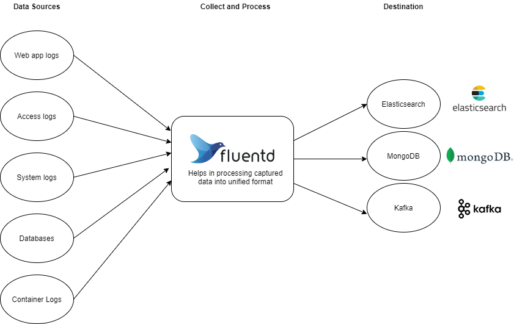
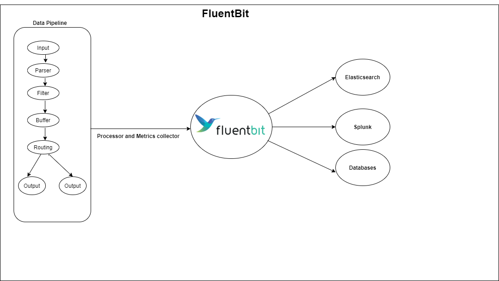

## Fluentd
- Fluentd is a OpenSource unified log collector.
- Inorder to collect logs from different applications running as microservices on kubernetes cluster for many reasons like security compliance(access logs), debug data etc.,
- Fluentd collections the log data stored in different locations(example: /var/log) written in different formats and consolidate with single format.
- Fluentd helps to store data into DB like Elasticseach to store for analysis.
- Logs can be captured from third-party applications, nginx-controller for Ingress in K8S, system and infrastructure logs etc., with unified soultion as Fluntd.
- Fluentd will deployed on kubernetes cluster as daemonset to capture POD logs located on host under "/var/log/pods".
- Since logs will be collected in different formats to undified format to enrich the output for analysis.
- Any data/Data source is captured by Fluentd and pushed to any Destination as mentioned below screenshot.
- Fluent can be deployed and configured using manifests and helm charts for k8s.
- Fluentd provides wide verity of plugins like Input, Output, Filter, Parser, Formatter Plugins etc.,
- Fluentd saves data on hard drive, which helps data to be available even after Fluentd pod restarts.
- No additional storage configuration needed.
- Use Cases:
    - Fluentd can be intigrated with Kubernetes.
    - Fluentd can be intigrated with IoT applications.
    - Fluentd can be intigrated with Bare Metal servers.

## Fluentbit
- Fluentbit is a OpenSource Lightweight and High Performance Log and Metrics processor.
- It helps to analyze and capture the logs to check for Bugs and issues.
- It works same as **Fluentd** and also captures the Metrics like CPU, Memory, Storage etc.,
- Fluentbit can be deployed on any platforms like Bare Metal servers, Virtual Machines, Embedded Device, Pod and Container.
- Sinces applications deployed on Kubernetes cluster as Pod(one or more containers per POD) has different formats specific to that applications and has multiple replicas to idenfity for which it captures.
- Fluentbit helps to Collect --> Process --> Store
- Flow: input --> parser --> filter --> buffer --> routing
    - input: plugin is used to gather information from different sources.
    - parser: covert unstructured to structured messages.
    - filter: modify records, enrich records, drop record, custom lua scripts.
    - SQL Queries on logs or metrics.
    - output: elasticsearch, splunk etc.,
- FluentBit will deployed on Kubernetes as Daemonset to run on all nodes of the Cluster.
- Multiple plugins can be intigrated with FluentBit.
- Built-In Security, Simple Architecture.

## Differences between Flunetd and FluentBit
- Memory: FluentBit uses ~650KB and FluntD uses ~40MB.
- Dependencies: FluntBit has Zero dependencies and Fluentd has Built as a Ruby Gem, it requires a certain number of gems.
- Performance: FluentBit has High Performance at Low cost and Fluentd has High Performance.
- FluentBit: Design for High Scale with low resources when you want you log proccessor to capture huge logs on the cluster with more efficient way.
- FluentBit: it was a preferred soltion for containerized environments like Kubernetes.
- Both are CNCD projects

## Elasticsearch
- Elasticsearch is a distributed, free and open search and analytics engine for all types of data, including textual, numerical, geospatial, structured, and unstructured.
- Elasticsearch is built on Apache Lucene and was first released in 2010 by Elasticsearch N.V. (now known as Elastic).
- It has simple REST APIs, distributed nature, speed, and scalability, Elasticsearch is the central component of the Elastic Stack, a set of free and open tools for data ingestion, enrichment, storage, analysis, and visualization.
- Elasticsearch provides near real-time search and analytics for all types of data. Whether you have structured or unstructured text, numerical data, or geospatial data, Elasticsearch can efficiently store and index it in a way that supports fast searches.

### References:
- [Fluentd](https://github.com/fluent/fluentd-kubernetes-daemonset)